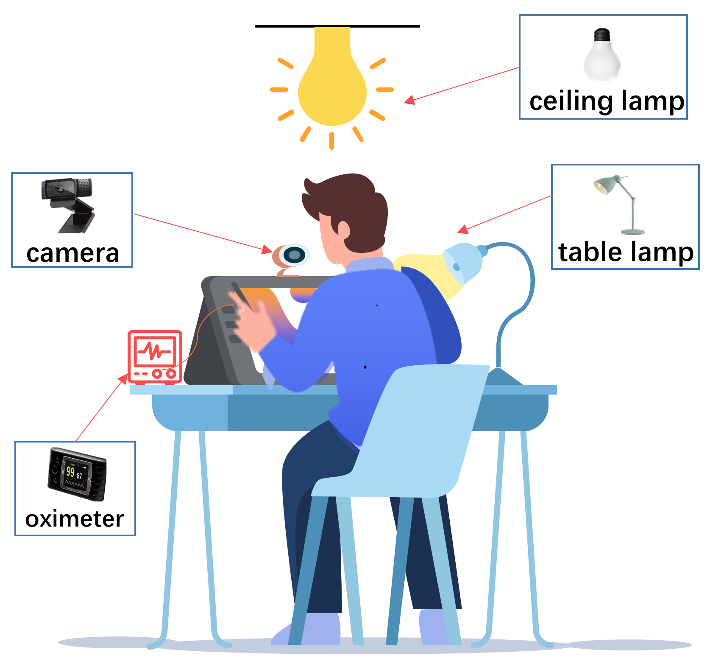
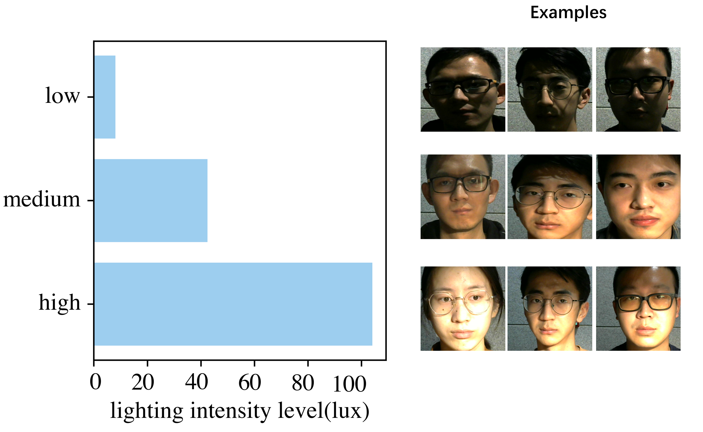

# BH-rPPG dataset
## 1.Overview
BH-rPPG dataset(stands for Beihang University Remote PhotoPlethysmoGraphy) is a dataset consists of 3 lighting conditions with uneven distribution which collected in indoor environment. In order to evaluate the performance of deep learning based rPPG under different lighting conditions, we recruited twelve healthy subjects (11 males and 1 females) on campus, with a  mean age of 32, SD of 2.5. 
## 2.Device setup
There are two light sources (an ceiling lamp and a table lamp) that create different lighting conditions. The ceiling lamp is to offer necessary illumination. And the table lamp used as extra illumination. The specific setup is shown in below.

The status of lamps are shown below.
| Lighting condition |    Ceiling lamp    | Table lamp |
| :----------------: | :----------------: | :--------: |
|        Low         | :heavy_check_mark: |    off     |
|       Medium       | :heavy_check_mark: |   normal   |
|        High        | :heavy_check_mark: |    high    |
## 3.Data details
Every subject is recorded with a video using low cost webcam (Logitech HD pro webcam C310 color camera) which inlcudes 900 frames without compression and its time stamps correspondly. Due to the unstable frame rate for insufficient lighting intensity, the fps is about 20. The oximeter (CONTEC CMS50E) also synchronously record the PPG wave value at sample frequency of 61hz. There are 12*3 videos in this dataset. The example of different lighting conditions are shown below.

## 4.Contact
Ze Yang (yangze@buaa.edu.cn), School of Computer Science and Engineering, Beihang University
## 5.Download
* This database is released to universities and research institutes for research purpose only.

* Note that please contact yangze@buaa.edu.cn for requests using an official email address (that is, university or institute email address, and non-official email addresses such as Gmail and 163 are not acceptable). When we receive your reply, we would provide the download link to you.
